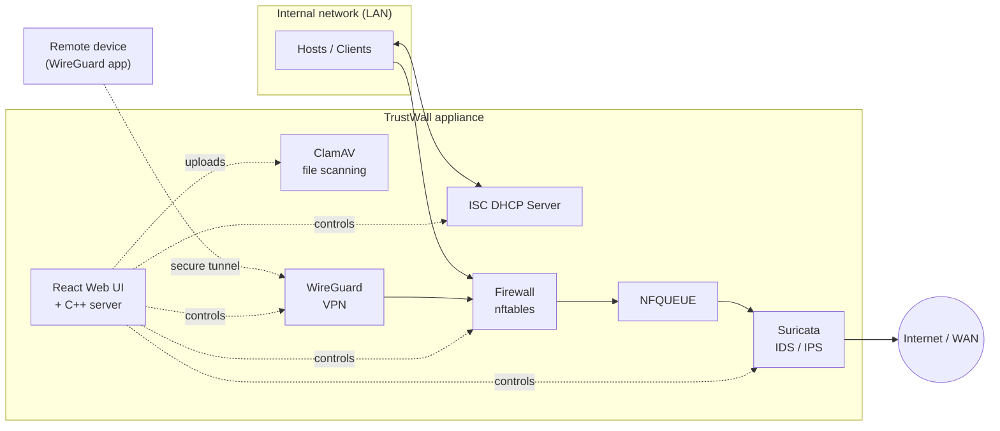

<div align="center">

# 🛡️ TrustWall

### A lightweight, modular, open-source Unified Threat Management (UTM) system for Linux

Firewall · IDS/IPS · VPN · Antivirus · DHCP · Web-based monitoring — in one appliance.


</div>

---

## 📖 Overview

Traditional security tools often work in silos: a firewall here, an antivirus there, an intrusion detection system somewhere else. This leaves gaps in protection and makes management complex and costly, especially for small and medium businesses (SMBs) and home users who have no dedicated IT security team.

**TrustWall** is a Unified Threat Management (UTM) system that brings the essential network security services into **a single, modular Linux appliance** with a **web-based control panel**. It is designed to be **cost-effective, lightweight, and customizable**, and it can run on a standard x86-64 machine or on low-cost hardware such as a **Raspberry Pi 4/5**.

> 🎓 TrustWall was built as the **B.Tech Major Project (2024–25)** at the Department of Computer Science and Technology, **IIEST Shibpur**, under the supervision of **Prof. Manas Hira**.

### Is it an embedded system?

TrustWall is a **software-defined network security appliance running on a general-purpose Linux OS** (Ubuntu 24.04 Server). It is **not** a bare-metal or RTOS-based embedded firmware project. However, it is **designed to be deployable on embedded-class hardware** (Raspberry Pi 4/5), which lets it function as a low-cost, dedicated security gateway, much like a commercial security appliance.

---

## ✨ Features

| Module | Technology | What it does |
|---|---|---|
| 🔥 **Firewall** | `nftables` (Netfilter) | Stateful packet filtering, NAT, port forwarding/redirect, MAC-based rules, and reusable IP/port/MAC sets. By default, all traffic is blocked until rules allow it. |
| 🕵️ **IDS / IPS** | `Suricata` | Deep packet inspection of traffic forwarded from the firewall through **NFQUEUE**. Per-interface instances, start/stop/restart controls, scheduled rule updates, alert and log viewers. |
| 🔐 **VPN** | `WireGuard` | Secure remote access. The web UI generates a client key pair and a **QR code** that is scanned with the WireGuard mobile app to establish a tunnel instantly. |
| 🦠 **Antivirus** | `ClamAV` | Standalone, on-demand scanning of files uploaded through the web interface, with quarantine support. |
| 🌐 **DHCP** | `ISC DHCP Server` | Automatic IP assignment for LAN clients, configured entirely from the web UI (address pool, default and maximum lease time, start/stop/restart). |
| 📊 **Monitoring** | C++ server + React | Real-time dashboard (network traffic, CPU, memory, disk), services table (enable/disable/start/stop/restart), and active connections table. |
| 🔑 **Authentication** | Web login | Login page protecting the management console. |

---

## 🏗️ Architecture



### How traffic is handled

1. Every packet from the LAN first reaches the **firewall (nftables)**, which checks it against rules at the **data link, network, and transport layers** and allows or blocks it.
2. Packets that pass are handed to **Suricata through NFQUEUE**, which lets a user-space program inspect packets.
3. **Suricata** performs deep packet inspection on the packet content. Clean traffic continues to the **WAN / Internet**; threats are alerted on or dropped.
4. The **DHCP server**, **WireGuard VPN**, **ClamAV scanner**, and **web interface** manage network configuration, remote access, file safety, and administration.

---

## 🖼️ Screenshots

A tour of the TrustWall web console.

<table>
  <tr>
    <td align="center"><br><sub><b>CAPTION 1</b></sub></td>
    <td align="center"><br><sub><b>CAPTION 2</b></sub></td>
  </tr>
  <tr>
    <td align="center"><br><sub><b>CAPTION 3</b></sub></td>
    <td align="center"><br><sub><b>CAPTION 4</b></sub></td>
  </tr>
  <tr>
    <td align="center"><br><sub><b>CAPTION 5</b></sub></td>
    <td align="center"><br><sub><b>CAPTION 6</b></sub></td>
  </tr>
  <tr>
    <td align="center"><br><sub><b>CAPTION 7</b></sub></td>
    <td align="center"><br><sub><b>CAPTION 8</b></sub></td>
  </tr>
  <tr>
    <td align="center"><br><sub><b>CAPTION 9</b></sub></td>
    <td align="center"><br><sub><b>CAPTION 10</b></sub></td>
  </tr>
  <tr>
    <td align="center"><br><sub><b>CAPTION 11</b></sub></td>
    <td align="center"><br><sub><b>CAPTION 12</b></sub></td>
  </tr>
</table>

---

## 🔍 Module Details

### 🔥 Firewall (nftables)
- Built on **Netfilter hooks** in the Linux kernel (prerouting, input, forward, output, postrouting).
- Supports **network rules** (source/destination address, port, protocol, interface, rate, burst, action), **forward/redirect rules**, **MAC rules** (MAC rules take priority over IP rules), and **sets** of similar elements (IPs, ports, MACs).
- Rule changes are applied through the web interface.

### 🕵️ IDS / IPS (Suricata)
- Suricata is applied **per network interface**; each instance has its own folder containing configuration, logs (HTTP, TLS, DNS), a **PID file**, and a **service file**.
- **Start / Restart / Stop** controls from the UI.
- **Automatic rule updates** on a configurable interval and start time, with an optional **live rule swap** (no hard restart).
- **Alerts view** (most recent 250 entries first) and a **log browser** per interface.
- Tunable engine settings such as run mode, max pending packets, detection-engine profile, pattern-matcher algorithms, EVE JSON output, and the protected home network.

### 🌐 DHCP (ISC DHCP Server)
- Configure the LAN interface, **IP address pool**, **default lease time**, and **maximum lease time** from the web UI.
- After saving, **Start / Stop / Restart** controls activate the service so hosts on the LAN can receive addresses automatically.

### 🔐 VPN (WireGuard)
- A request from the web UI generates a client key pair and encodes the client configuration into a **QR code**.
- Scanning the code with the WireGuard mobile app establishes a secure tunnel to TrustWall for remote administration.

### 🦠 Antivirus (ClamAV)
- Runs as a **standalone, on-demand service** focused on **user-uploaded files** (not full network-stream scanning), keeping resource usage low.
- Detects malware using ClamAV's regularly updated signature database (verified with the standard EICAR test file) and supports a quarantine policy for administrator review.

### 📊 Dashboard & Monitoring
- **Dashboard:** real-time traffic graphs, CPU usage by category, memory usage, and per-disk usage.
- **Services table:** view status and enable, disable, start, stop, or restart system services.
- **Active connections table:** local/remote IP and port, protocol, and connection state.

---

## 🧰 Tech Stack

| Layer | Technology |
|---|---|
| Operating system | Ubuntu 24.04 LTS Server |
| Firewall | nftables / Netfilter |
| IDS / IPS | Suricata (via NFQUEUE) |
| VPN | WireGuard |
| Antivirus | ClamAV |
| DHCP | ISC DHCP Server |
| Frontend | React.js (`Web_Interface/`, built with Node.js / npm) |
| Backend | C++17 server (`C++/`) with D-Bus / systemd service control |
| Database | SQLite (configuration data and logs) |
| Hardware targets | Intel x86-64, Raspberry Pi 4 / 5 |

---

## ⚖️ How TrustWall Compares

| | Firewall | IDS/IPS | Antivirus | VPN | Hardware platform | Software platform |
|---|:-:|:-:|:-:|:-:|---|---|
| pfSense | ✅ | ✅ | ✅ | ✅ | x86-64 | FreeBSD, PHP |
| OPNsense | ✅ | ✅ | ✅ | ✅ | x86-64 | FreeBSD, PHP |
| IPFire | ✅ | ✅ | ✅ | ✅ | x86-64 | Linux, Perl |
| ClearOS | ✅ | ✅ | ✅ | ✅ | x86-64 | Linux, PHP |
| **TrustWall** | ✅ | ✅ | ✅ | ✅ | **x86-64 + Raspberry Pi 4/5** | **Ubuntu 24.04, C++, React** |

TrustWall targets **SMBs and home users** who need solid network security with lower hardware requirements and more room for customization.

---

## 🚀 Getting Started

TrustWall has two parts that run side by side:

```
Browser ──HTTP :3000──▶ React Web Interface ──API / WebSocket──▶ C++ TrustWall Server (:5000)
                                                                     │
                                                                     ├── Firewall (nftables)
                                                                     ├── Suricata IDS/IPS
                                                                     ├── DHCP
                                                                     ├── VPN (WireGuard)
                                                                     ├── Network interfaces
                                                                     └── System monitoring & services
```

```
Trustwall_Major_Project/
├── C++/             # Backend server (firewall, Suricata, DHCP, VPN, antivirus, monitoring)
└── Web_Interface/   # React frontend
```

> ⚠️ **Safety first.** TrustWall changes real firewall and network settings and **blocks all traffic by default** until rules are added. Test it on a lab machine or VM, not on a remote server you rely on, or you may lock yourself out.

### Prerequisites
- Ubuntu 24.04 LTS (x86-64 or Raspberry Pi 4/5)
- `sudo` access (the backend performs privileged networking and security operations)
- Node.js and npm (for the React frontend)

### 1. Install system dependencies

```bash
sudo apt update
sudo apt install -y \
    build-essential \
    pkg-config \
    libdbus-1-dev \
    nlohmann-json3-dev \
    libqrencode-dev \
    libpng-dev \
    libcrypt-dev \
    nftables \
    suricata \
    sysstat \
    rfkill \
    nodejs \
    npm
```

To use the other modules, also install:

```bash
sudo apt install -y isc-dhcp-server wireguard clamav clamav-daemon
```

### 2. Clone the repository

```bash
git clone https://github.com/MontyAnand/Trustwall_Major_Project.git
cd Trustwall_Major_Project
```

### 3. Build and start the C++ backend

```bash
cd C++

g++ -std=c++17 \
    Antivirus.cpp \
    VPN.cpp \
    IPPool.cpp \
    Utility.cpp \
    QR.cpp \
    Server.cpp \
    HealthMonitor.cpp \
    Authentication.cpp \
    SystemdServiceManager.cpp \
    Executor.cpp \
    Interface.cpp \
    Firewall.cpp \
    main.cpp \
    -L/usr/local/lib \
    -lqrencode \
    -lpng \
    -lcrypt \
    $(pkg-config --cflags --libs dbus-1)

sudo ./a.out
```

The server listens on **`http://127.0.0.1:5000`**. Keep this terminal open.

> 💡 **Shortcut:** `cd C++ && ./init.sh` runs the same build-and-start steps in one command.

### 4. Start the React frontend

In a **second terminal**, from the repository root:

```bash
cd Web_Interface
npm install
npm start
```

The web interface is served at **`http://localhost:3000`**. Keep this terminal open too.

### 5. Open TrustWall

Visit **http://localhost:3000** in your browser and log in. Authentication is checked against the host's system user accounts.

### Stopping

Press `Ctrl + C` in both terminals. Services you started from the UI (Suricata, DHCP, WireGuard) keep running until you stop them from the web interface or with `systemctl`.

### Troubleshooting

| Problem | Fix |
|---|---|
| `fatal error: nlohmann/json.hpp: No such file` | Install `nlohmann-json3-dev`. |
| `cannot find -lqrencode` / `-lpng` | Install `libqrencode-dev` and `libpng-dev`. |
| `dbus/dbus.h: No such file` | Install `libdbus-1-dev` and `pkg-config`. |
| Frontend loads but shows no data | Make sure `sudo ./a.out` is running on port 5000. |
| Port 3000 or 5000 already in use | Stop the other process, or free the port with `sudo lsof -i :5000`. |
| Lost network access after adding rules | The default policy blocks traffic. Select the correct input and output interfaces and add an allow rule. |

---

## 👥 Team

B.Tech Major Project, Computer Science and Technology, IIEST Shibpur (2024–25)

| Name | Roll No. |
|---|---|
| Vivek Kumar | 2021CSB009 |
| Anirban Debnath | 2021CSB030 |
| **Sujit Halder** | 2021CSB036 |
| Sudeshna Basak | 2021CSB052 |
| R Veda Shree | 2021CSB099 |
| Abdul Khazamuddin | 2020CSB013 |

**Supervisor:** Prof. Manas Hira

### 🙋 Contributions — Sujit Halder
- Implemented the **IDS/IPS module using Suricata**: per-interface instances, service control, rule-update scheduling, and alert and log viewing.
- Implemented the **DHCP service using ISC DHCP** with web-based configuration and service control.
- Carried out the **hardware platform support study** (x86-64 and Raspberry Pi 4/5) to turn the UTM software into a complete, deployable product.

---

## 🔭 Future Scope

- 🤖 **AI/ML-based threat detection** to catch unknown or evolving attacks beyond signature matching
- 👤 **User management with Role-Based Access Control (RBAC)** and audit logs (currently only the root user has control)
- 🔔 **Notification system** for critical events via SMS or email
- 🔒 **Secure DNS** (DNS over HTTPS / TLS) to prevent DNS spoofing and hijacking
- ⚡ **Custom minimal Linux build** that removes unneeded services to reduce CPU and memory usage
- 🧪 **Hardware health testing** for network interfaces and storage drives

---

## 📚 References

- [WireGuard: Next Generation Kernel Network Tunnel](https://www.wireguard.com/papers/wireguard.pdf)
- [RFC 2131 – Dynamic Host Configuration Protocol](https://www.ietf.org/rfc/rfc2131.txt)
- [RFC 4301 – Security Architecture for the Internet Protocol](https://www.rfc-editor.org/rfc/rfc4301)
- [The netfilter/iptables project](https://www.netfilter.org/)
- [ClamAV](https://www.clamav.net/)
- [pfSense](https://docs.netgate.com/pfsense/en/latest/) · [OPNsense](https://docs.opnsense.org/) · [IPFire](https://www.ipfire.org/docs)

---

<div align="center">

**TrustWall: strong network security doesn't have to be expensive or complicated.**

</div>
